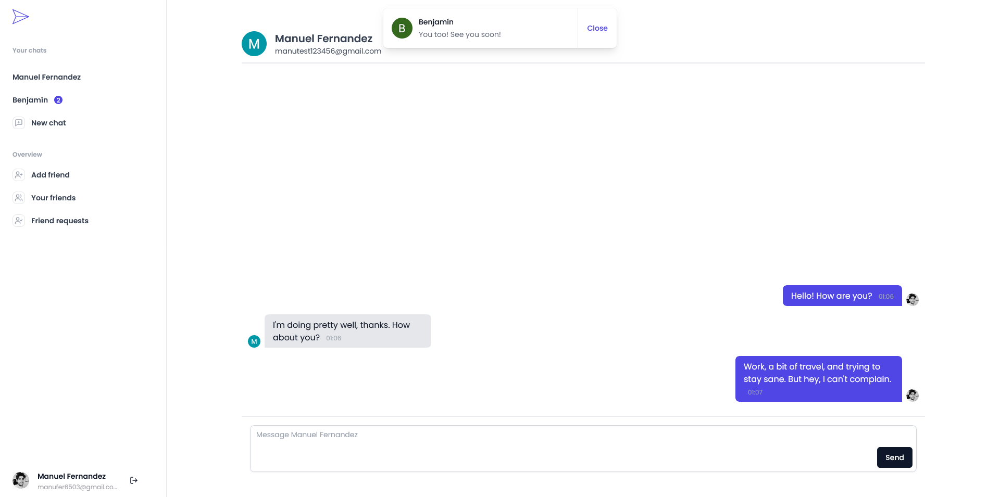

# Realtime chat with NextJS 13 :rocket:

## Description

This project draws inspiration from a tutorial by [Josh tried coding](https://www.youtube.com/@joshtriedcoding) YouTube channel. While the initial concept originates from his work, I've implemented substantial enhancements to the code and project structure based on my own discretion.

### Main features :page_facing_up:

**Realtime chat:** instant communication with other users within the platform.

**Friend management:** Add and delete friends.

**Instant notifications:** Receive in-time notifications while logged.

### Techs :wrench:

**NextJS:** React fullstack framework.

**Pusher:** An API to implement realtime features based on pub/sub channels.

**Redis y Upstash:** Serverless data platform with an integrated Redis db client.

**NextAuth:** Open-source authentication solution for Next.js apps.

### Screenshot :iphone:



## Deploy link :link:

### :arrow_right: [https://realtime-chat-prod.vercel.app](https://realtime-chat-prod.vercel.app) :arrow_left:

## Run locally

#### NodeJS

For this project I used v18.18.0 of NodeJS. There is a _.nvmrc_ file to select the correct version with **nvm**.
To do this in Windows open a PowerShell terminal in the projects root directory and run `nvm use $(Get-Content .nvmrc)`.
In Linux or Mac, open a terminal in the project directory and run `nvm use`.

If you don't have nvm installed in your computer, ensure that you have that specific node version. You can check your Node version by running `node -v` in a terminal.

#### <sub>See [nvm](https://github.com/nvm-sh/nvm) or [nvm-windows](https://github.com/coreybutler/nvm-windows) for more info.</sub>

#### Packages

Once you ensure that you have the correct Node version, open a terminal inside the projects root directory and run `npm install`

#### Dev server

Run the development server:

```bash
/project-route npm run dev
```

Open [http://localhost:3000](http://localhost:3000) with your browser to see the result.

##### Ensure you have a Google account to access and log in to the app.

#### Scripts

scripts detail

- dev: starts development server on port 3000 by default
- build: starts building process for production
- start: runs the builded app on port 3000 by default
- lint: lints files

## Learn More

To learn more about Next.js, take a look at the following resources:

- [Next.js Documentation](https://nextjs.org/docs) - learn about Next.js features and API.
- [Learn Next.js](https://nextjs.org/learn/dashboard-app) - an interactive Next.js tutorial.

## Contact me :arrow_down:

#### :email: [manufer6503@gmail.com](mailto:manufer6503@gmail.com)

#### :link: [linkedin](https://www.linkedin.com/in/manuelffernandez/)

#### :iphone: +54 9 294 4650354
